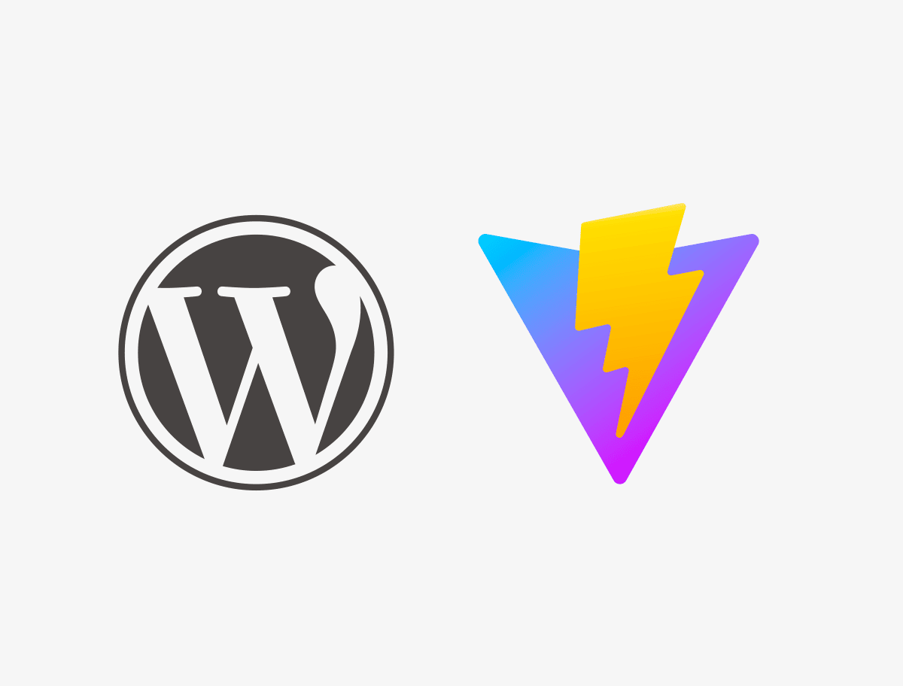

# WordPress Vite.js Developer Theme



A modern WordPress theme built with Vite.js, featuring optimized development workflow, testing capabilities, and production-ready CSS optimization.

## Features

### Core Technologies
- **[ES6](https://github.com/lukehoban/es6features#readme)** - Modern JavaScript with ES6+ features
- **[SASS](http://sass-lang.com/)** - CSS preprocessor following [SASS Guidelines](https://sass-guidelin.es/#the-7-1-pattern)
- **[Bootstrap 5](https://getbootstrap.com/docs/5.3/getting-started/introduction/)** - CSS framework ([customizable with SASS](https://getbootstrap.com/docs/5.3/customize/sass/))
- **[Vite.js](https://vitejs.dev/)** - Fast build tool with HMR and optimized bundling

### Development Tools
- **[Vitest](https://vitest.dev/)** - Fast unit testing framework
- **[PurgeCSS](https://purgecss.com/)** - Remove unused CSS for production
- **[JSDOM](https://github.com/jsdom/jsdom)** - DOM testing environment
- **Hot Module Replacement** - Instant updates during development

### WordPress Integration
- **Accessibility Ready** - ARIA labels, roles, and semantic markup
- **SEO Optimized** - Meta tags, Open Graph ready
- **Performance Focused** - Asset optimization and lazy loading ready
- **Security Enhanced** - HTTPS links and WordPress security best practices

## Requirements

- **[Node.js](https://nodejs.org/)** (v16 or higher)
- **WordPress** (v5.0 or higher)
- **PHP** (v7.4 or higher)

## Installation

1. Clone this repository in your WordPress themes directory:
```bash
git clone [repository-url] dev-theme
cd dev-theme
```

2. Install dependencies:
```bash
npm install
```

3. Activate the theme in WordPress Admin

## Development Commands

### Development
```bash
npm run dev          # Start development server with HMR
npm run build        # Build for production
npm run preview      # Preview production build
```

### Testing
```bash
npm run test         # Run tests in watch mode
npm run test:ui      # Run tests with visual interface
npm run test:run     # Run tests once
npm run test:coverage # Run tests with coverage report
```

## File Structure

```
dev-theme/
├── assets/
│   ├── src/
│   │   ├── js/
│   │   │   ├── main.js        # Main JavaScript entry
│   │   │   └── _general.js    # General utilities
│   │   └── scss/
│   │       ├── main.scss      # Main SCSS entry
│   │       ├── abstracts/     # Variables, mixins
│   │       ├── base/          # Base styles, fonts
│   │       ├── components/    # UI components
│   │       ├── layout/        # Layout components
│   │       └── pages/         # Page-specific styles
│   └── dist/                  # Compiled assets (auto-generated)
├── tests/
│   ├── setup.js               # Test configuration
│   └── example.test.js        # Example tests
├── header.php                 # Theme header
├── index.php                  # Main template
├── functions.php              # Theme functions
├── style.css                  # Theme info
└── vite.config.js            # Vite configuration
```

## Configuration

### Vite Configuration
- **PurgeCSS** - Automatically removes unused CSS in production
- **SASS Options** - Deprecation warnings silenced
- **Asset Optimization** - Images, fonts organized in dist folder
- **HMR** - Hot reload for PHP, JS, and SCSS files

### Testing Setup
- **Vitest** - Configured with JSDOM environment
- **WordPress Mocks** - Global wp, jQuery objects available
- **Test Utils** - DOM manipulation and assertion utilities

## PurgeCSS Safelist

The following classes are preserved in production builds:
- **Bootstrap**: `btn-*`, `nav-*`, `dropdown-*`, `modal-*`, etc.
- **WordPress**: `wp-*`, `post-*`, `page-*`, `comment-*`, etc.
- **Utilities**: `d-*`, `text-*`, `bg-*`, `border-*`, `p-*`, `m-*`

## Development Workflow

1. **Start Development**: `npm run dev`
2. **Write Code**: Edit PHP, SCSS, or JS files
3. **Test Changes**: `npm run test`
4. **Build for Production**: `npm run build`

## WordPress Integration

### Theme Support
- Navigation menus
- Post thumbnails
- HTML5 markup
- Custom logo
- Accessibility features

### Asset Loading
- Vite manifest integration
- Conditional loading (dev/production)
- Optimized asset delivery
- Cache-busting with hashed filenames

## Troubleshooting

### Development Mode
- Ensure Vite dev server is running (`npm run dev`)
- Check that port 5173 is available
- Verify WordPress site URL configuration

### SCSS Issues
- Use `@` alias for static directory: `background-image: url('@/img/logo.png');`
- Deprecation warnings are silenced in configuration
- Bootstrap customization should be done in `/abstracts/_variables.scss`

### Testing Issues
- Tests run in JSDOM environment
- WordPress globals are mocked
- DOM is reset between tests

## Performance Features

- **Code Splitting** - Automatic JS/CSS chunking
- **Asset Optimization** - Images, fonts, and media compression
- **CSS Purging** - Removes unused styles in production
- **Cache Busting** - Hashed filenames for optimal caching

## Browser Support

- Chrome/Edge (latest 2 versions)
- Firefox (latest 2 versions)
- Safari (latest 2 versions)
- IE11+ (with polyfills)

## Contributing

1. Fork the repository
2. Create a feature branch
3. Write tests for new features
4. Ensure all tests pass
5. Submit a pull request

## License

This theme is licensed under [GPL v2 or later](https://www.gnu.org/licenses/gpl-2.0.html).
